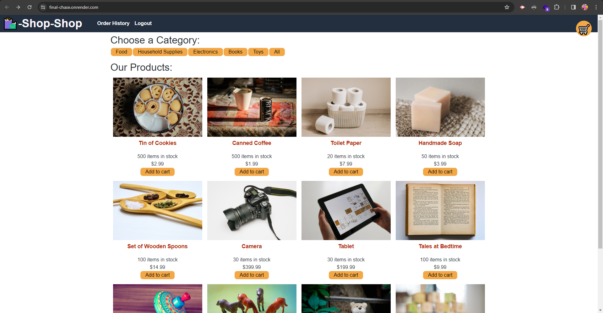

# final-chase

## Description
This application is an online store using Redux as its global state management. You are able to login, shop, and then proceed to checkout using Stripe.

## Main NPMs
[Vite](https://www.npmjs.com/package/vite)  
[Apollo/Client](https://www.npmjs.com/package/@apollo/client)  
[Apollo/Server](https://www.npmjs.com/package/@apollo/server)  
[React](https://www.npmjs.com/package/react) (Including the react-dom and react-router-dom)    
[REDUX](https://www.npmjs.com/package/redux) (Including react-redux)  
[JWT](https://www.npmjs.com/package/jsonwebtoken)  
[MonGoose](https://www.npmjs.com/package/mongoose)  

## Link and Screenshot
### [Final-Chase](https://final-chase.onrender.com/)
